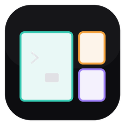

# miniterm

A fast, GPU-rendered terminal multiplexer for Windows, written in Rust. One
window hosts many ConPTY shells organized into **workspaces**, each holding a
**tiling split layout** with mouse drag-resize and automatic PTY resizing —
built around a strict idle-0%-CPU invariant.

> _Türkçe açıklama için [aşağıya](#türkçe) bakın._

---

## Features

- **Single window, many shells** — every pane is a real Windows `cmd.exe`
  running over ConPTY (via `portable-pty`).
- **Workspaces** — a 180px left sidebar groups shells into named workspaces;
  rename and delete them inline.
- **Tiling splits** — split panes horizontally or vertically, drag the colored
  borders with the mouse to resize; panes auto-resize their PTY to match.
- **GPU rendering** — `wgpu` instanced quads with an `R8Unorm` glyph atlas;
  cell grid rasterized once and reused.
- **TOML config** — theme colors and font family/size from a config file, with
  graceful fallback to built-in defaults when the file is missing or malformed.
- **Idle-0%-CPU** — the window only redraws on genuine damage (winit `Wait`
  mode). No timers, no polling, no wakeups while nothing changes.

## Keybindings

| Chord | Action |
|-------|--------|
| `Ctrl+Shift+D` | Split focused pane side-by-side (horizontal) |
| `Ctrl+Shift+S` | Split focused pane stacked (vertical) |
| `Ctrl+Shift+W` | Close focused pane |
| `Ctrl+Shift+Tab` / `Ctrl+Shift+O` | Cycle pane focus |
| `Ctrl+Shift+N` | New workspace |
| `Ctrl+Shift+PageDown` | Next workspace |
| `Ctrl+Shift+PageUp` | Previous workspace |
| `Ctrl+C` | Send interrupt (ETX) to the shell |

**Mouse:** click a pane to focus it, drag a split border to resize, click a
sidebar row to switch workspaces, and click `+` to create a new workspace.

## Configuration

miniterm reads `%APPDATA%\miniterm\config.toml` once at startup. Every field is
optional; anything missing or invalid falls back to the built-in default, so a
partial or absent file is always safe.

```toml
[font]
family = "Cascadia Code"   # optional; defaults to "JetBrains Mono", falling back to Windows Terminal / console / bundled Consolas if unavailable
size = 18.0

[colors]
background = "#0d0d10"      # #rrggbb, leading '#' optional, case-insensitive
foreground = "#d8d8d8"
cursor     = "#d8d8d8"
```

If the file is absent, unreadable, or fails to parse, miniterm logs a single
line to stderr and continues with defaults.

## Install / Run

**Download (no build):** grab the latest `miniterm-*-windows-x64.exe` from the
[Releases](https://github.com/kad1r/miniterm/releases) page and run it. The
binary is fully standalone — the font is embedded, no install or extra files
needed.

**From source, permanent install:** with a Rust toolchain (Windows,
`stable-x86_64-pc-windows-gnu`):

```bash
cargo install --path .
```

This builds the release binary into `~/.cargo/bin`, which is already on your
PATH — then just run `miniterm` from anywhere.

**Run without installing:**

```bash
cargo run --release
```

Use `--release` — the debug build is noticeably slower to start.

## Performance

Measured on a 100-pane stress test (10 workspaces × 10 panes, all idle):

| Layer | 100 panes | per pane |
|-------|-----------|----------|
| miniterm core (grid + parser + reader thread) | ~207 MB | ~2.1 MB |
| `cmd.exe` + ConPTY host processes (OS side) | ~1.8 GB | ~18 MB |
| **Total** | **~2.0 GB** | **~20 MB** |

The dominant cost is the operating-system shell and ConPTY host processes, not
miniterm itself (its own share is ~10%). Idle CPU stays at ~0%: every reader
thread blocks on `read()`, and only the **active** workspace is ever rendered —
background workspaces hold state but never touch the GPU.

## Architecture

`App → Vec<Workspace>`; each `Workspace` owns a layout tree, a slot-map of
`Session`s (one ConPTY shell each), focus, and per-pane border colors. The
window is a fixed sidebar plus a pane area. Terminal parsing uses
`alacritty_terminal`; text shaping uses `swash`.

## Status

Milestones M1–M3 (single terminal, splits, workspaces) and M4-A (config &
theme) are complete. Deferred: 16-color ANSI palette, per-cell colors,
keybinding config, scrollback, live config reload.

---

## Türkçe

**miniterm** — Rust ile yazılmış, GPU ile render edilen hızlı bir Windows
terminal multiplexer'ı. Tek pencere, **workspace**'lere ayrılmış birçok ConPTY
shell'i barındırır; her workspace fare ile yeniden boyutlandırılabilen ve PTY'si
otomatik ayarlanan bir **tiling (döşeme) split düzeni** tutar. Tasarımın
merkezinde katı bir **idle'da %0 CPU** ilkesi vardır.

### Özellikler

- **Tek pencere, çok shell** — her pane, ConPTY üzerinden çalışan gerçek bir
  Windows `cmd.exe`'dir (`portable-pty` ile).
- **Workspace'ler** — soldaki 180px kenar çubuğu shell'leri isimli
  workspace'lerde gruplar; yerinde yeniden adlandırılır ve silinir.
- **Tiling split** — pane'leri yatay/dikey böl, renkli border'ları fareyle
  sürükleyerek boyutlandır; pane'ler PTY'lerini otomatik uyarlar.
- **GPU render** — `wgpu` instanced quad + `R8Unorm` glyph atlas'ı.
- **TOML config** — tema renkleri ve font ailesi/boyutu dosyadan; dosya yoksa
  veya bozuksa yerleşik varsayılanlara güvenli düşüş.
- **Idle'da %0 CPU** — pencere yalnızca gerçek değişimde yeniden çizilir (winit
  `Wait` modu). Zamanlayıcı yok, polling yok.

### Kısayollar

| Tuş | İşlev |
|-----|-------|
| `Ctrl+Shift+D` | Odaklı pane'i yan yana böl (yatay) |
| `Ctrl+Shift+S` | Odaklı pane'i üst üste böl (dikey) |
| `Ctrl+Shift+W` | Odaklı pane'i kapat |
| `Ctrl+Shift+Tab` / `Ctrl+Shift+O` | Pane odağını değiştir |
| `Ctrl+Shift+N` | Yeni workspace |
| `Ctrl+Shift+PageDown` | Sonraki workspace |
| `Ctrl+Shift+PageUp` | Önceki workspace |
| `Ctrl+C` | Shell'e kesme sinyali (ETX) gönder |

**Fare:** odaklamak için pane'e tıkla, boyutlandırmak için split border'ını
sürükle, workspace değiştirmek için kenar çubuğu satırına tıkla, yeni workspace
için `+`'ya tıkla.

### Yapılandırma

miniterm başlangıçta `%APPDATA%\miniterm\config.toml` dosyasını bir kez okur.
Tüm alanlar isteğe bağlıdır; eksik veya geçersiz olan varsayılana düşer, bu
yüzden kısmi veya olmayan bir dosya her zaman güvenlidir.

```toml
[font]
family = "Cascadia Code"   # isteğe bağlı; varsayılan "JetBrains Mono", yoksa Windows Terminal / konsol / gömülü Consolas'a düşer
size = 18.0

[colors]
background = "#0d0d10"      # #rrggbb, baştaki '#' opsiyonel, büyük/küçük harf duyarsız
foreground = "#d8d8d8"
cursor     = "#d8d8d8"
```

Dosya yoksa, okunamıyorsa veya ayrıştırılamıyorsa miniterm stderr'e tek satır
log basar ve varsayılanlarla devam eder.

### Kurulum / Çalıştırma

**İndir (derleme yok):** [Releases](https://github.com/kad1r/miniterm/releases)
sayfasından en son `miniterm-*-windows-x64.exe` dosyasını indir ve çalıştır.
Binary tamamen standalone — font gömülü, kurulum veya ek dosya gerekmez.

**Kaynaktan, kalıcı kurulum:** Rust toolchain ile (Windows,
`stable-x86_64-pc-windows-gnu`):

```bash
cargo install --path .
```

Release binary'yi zaten PATH'te olan `~/.cargo/bin`'e derler — sonra her yerden
`miniterm` yazıp çalıştırırsın.

**Kurmadan çalıştır:**

```bash
cargo run --release
```

`--release` kullan — debug build gözle görülür şekilde daha yavaş açılır.

### Performans

100 pane'lik stres testinde ölçüldü (10 workspace × 10 pane, hepsi idle):

| Katman | 100 pane | pane başına |
|--------|----------|-------------|
| miniterm çekirdek (grid + parser + reader thread) | ~207 MB | ~2.1 MB |
| `cmd.exe` + ConPTY host process'leri (OS tarafı) | ~1.8 GB | ~18 MB |
| **Toplam** | **~2.0 GB** | **~20 MB** |

Baskın maliyet miniterm değil, işletim sisteminin shell ve ConPTY host
process'leridir (miniterm'in kendi payı ~%10). Idle CPU ~%0'da kalır: her reader
thread `read()` üstünde bloklanır ve yalnızca **aktif** workspace render edilir —
arka plandaki workspace'ler durumu tutar ama GPU'ya asla dokunmaz.

### Mimari

`App → Vec<Workspace>`; her `Workspace` bir layout ağacı, `Session`'ların bir
slot-map'i (her biri bir ConPTY shell), odak ve pane başına border renklerini
tutar. Pencere = sabit kenar çubuğu + pane alanı. Terminal ayrıştırma
`alacritty_terminal`, metin şekillendirme `swash` ile yapılır.

### Durum

M1–M3 (tek terminal, split'ler, workspace'ler) ve M4-A (config & tema)
tamamlandı. Ertelendi: 16 renkli ANSI paleti, hücre başına renk, kısayol
yapılandırması, scrollback, canlı config yeniden yükleme.
