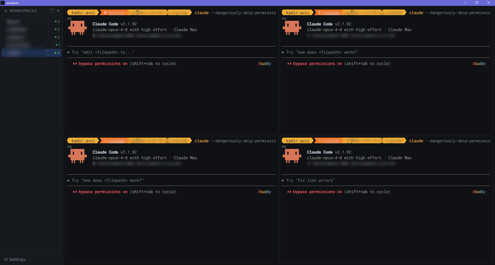
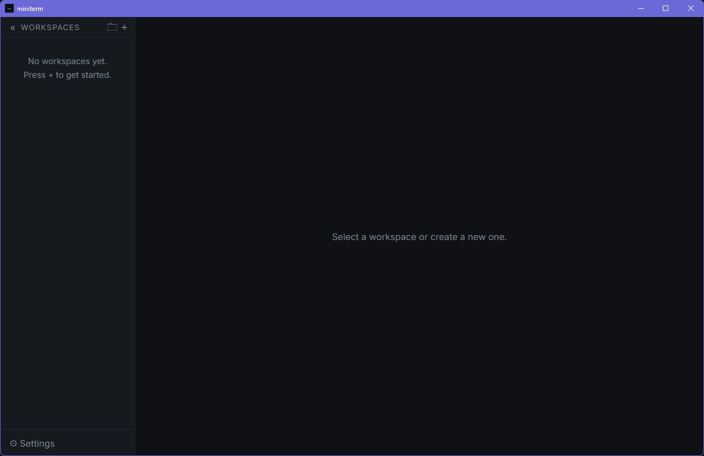
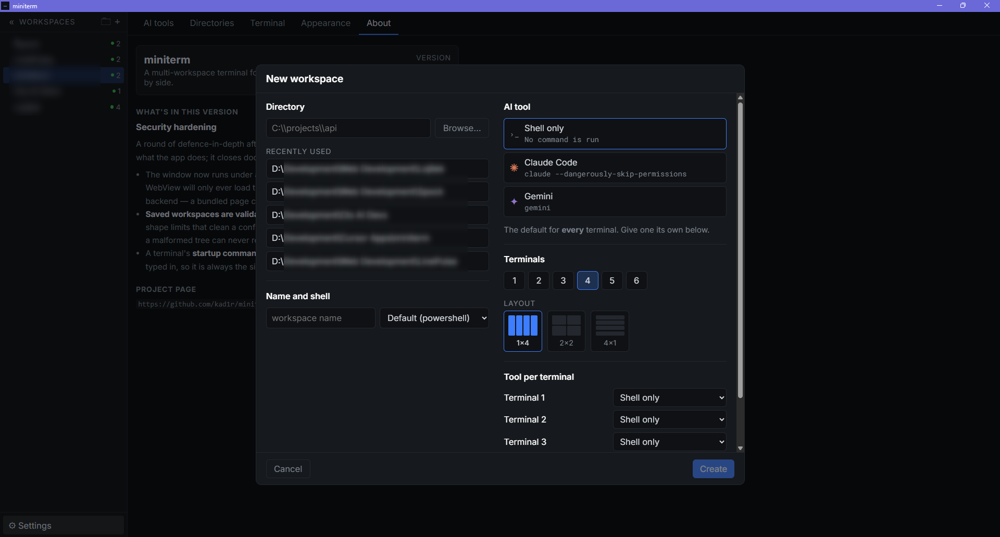
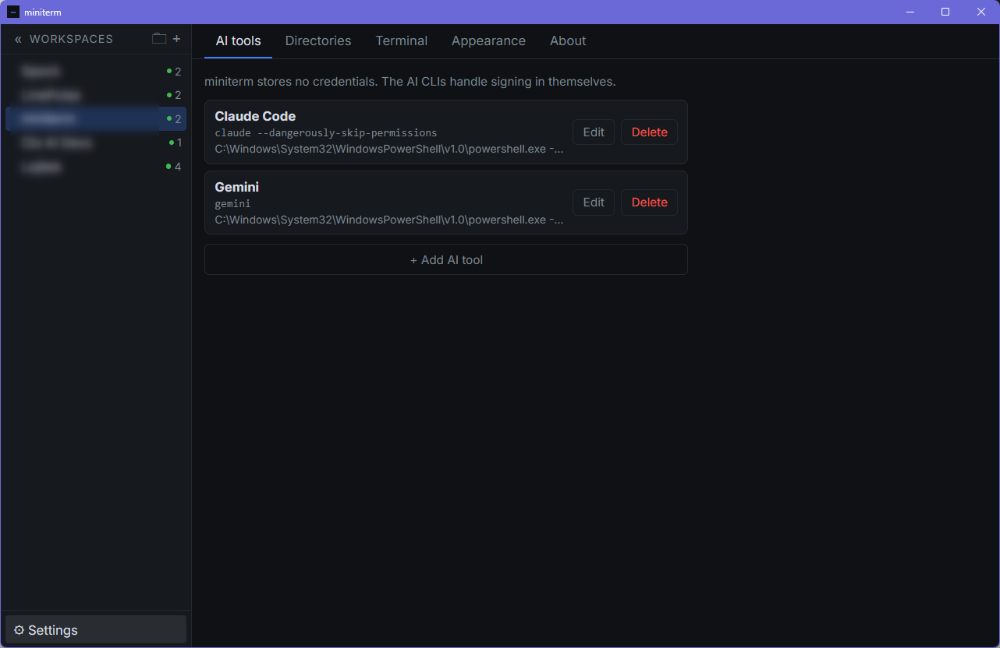
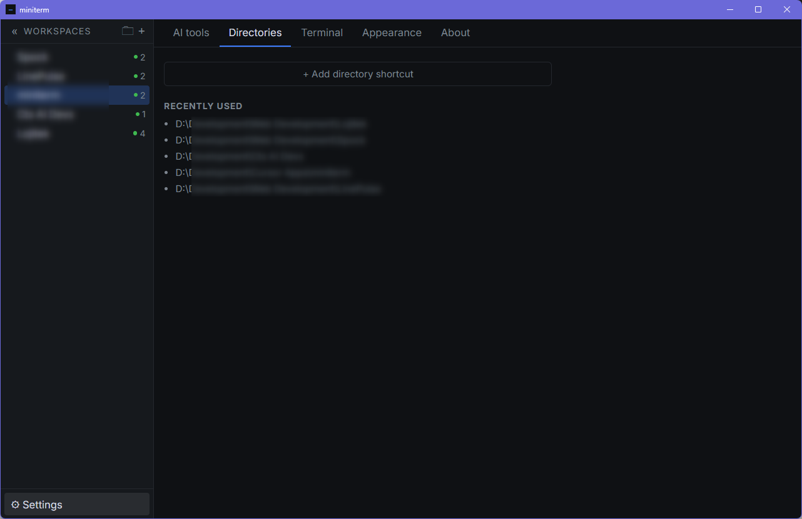
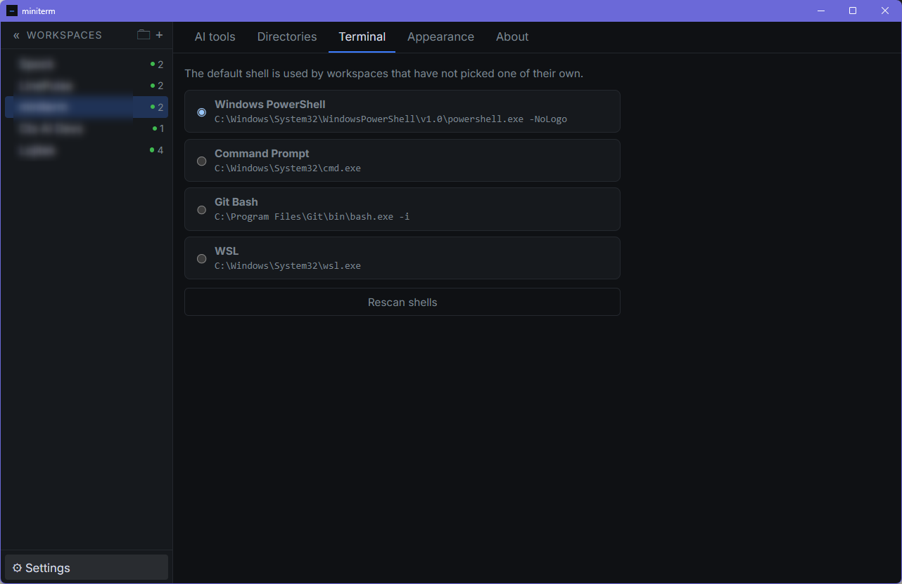
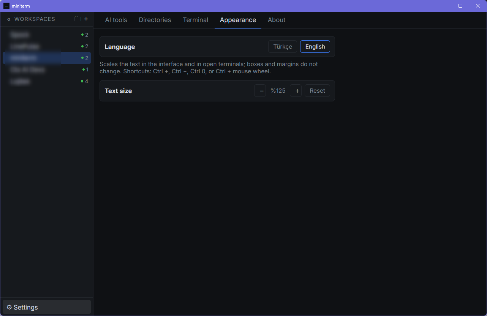

<div align="center">


# miniterm

**Birden çok AI CLI oturumunu yan yana çalıştırmak için çok-workspace terminal.**

Claude Code, Gemini CLI ve benzerlerini tek pencerede, ızgara düzeninde,
workspace başına ayrı dizinde çalıştırır.

Windows · macOS · Linux — Tauri 2 + Svelte 5 + xterm.js

**Türkçe** · [English](README.md)

</div>



---

## Neden

Bir AI CLI'yı aynı anda birkaç repoda ya da aynı reponun birkaç dalında
çalıştırmak, elle açılmış bir yığın terminal sekmesi demek. Hangi sekmenin hangi
dizinde olduğunu, hangisinin hâlâ çalıştığını takip etmek size kalır.

miniterm bunu tersine çevirir: **workspace** tanımlarsınız — bir dizin, bir AI
aracı, bir ızgara düzeni — gerisini uygulama kurar. Workspace'ler arasında geçiş
yaptığınızda süreçler ölmez; arka planda çalışmaya devam eder ve geri
döndüğünüzde çıktı olduğu yerden sürer.

## Ne yapar

**Workspace'ler**
- Sol tarafta ağaç görünümü; klasörlerle 5 seviyeye kadar gruplama, sürükle-bırak
  ile taşıma
- Her workspace = bir dizin + bir AI aracı + 1–6 terminalden oluşan ızgara
  (1×2, 2×2, 2×3 … düzenler)
- Seçilen aracın komutu ızgaradaki her terminale açılışta yazılır
- Bölme çizgileri sürüklenerek yeniden boyutlandırılır; oran workspace ile
  birlikte saklanır
- Kenar çubuğu daraltılabilir; daraldığında workspace'ler durum noktalı bir ikon
  rayına iner

**Oturumlar**
- Gizlenen workspace'lerin süreçleri yaşamaya devam eder
- Çıktı Rust tarafında oturum başına 256 KB'lık ring buffer'da tutulur; geri
  dönüldüğünde ekran bu tampondan yeniden çizilir
- Bir süreç ölünce panel kararır ve bilgi satırı basılır — Enter yeniden başlatır
- Kenar çubuğundaki nokta durumu gösterir: çalışıyor / kapandı / durdu

**Native terminal davranışı**
- `Ctrl+C` seçim varsa kopyalar, yoksa SIGINT gönderir — kopyalama seçimi
  tüketir, sonraki `Ctrl+C` yine kesme sinyalidir
- `Ctrl+V`, `Ctrl+Shift+V`, `Shift+Insert` yapıştırır; sağ tık menüsü de çalışır
- Dosya ya da klasör sürükleyip bırakınca tam yol imlece yazılır, kabuğa göre
  tırnaklanır (boşluklu Windows yolları, UNC yolları, POSIX tırnak kaçışları)
- `Ctrl` + `+` / `−` / `0` ve `Ctrl` + tekerlek yazı boyutunu değiştirir; pencere
  kromu değil yalnız terminal ölçeklenir
- `F2` seçili workspace'i yeniden adlandırır

**Arayüz**
- Türkçe ve İngilizce; ilk açılışta sistem diline göre seçilir, Ayarlar →
  Görünüm'den değiştirilir
- Odaklanmış terminal Claude turuncusuyla çerçevelenir
- WebGL renderer; bağlam kaybında sessizce canvas'a düşer
- Inter + Roboto Mono gömülü gelir, sistem fontlarına bağımlı değildir

## Kimlik bilgileri

miniterm **hiçbir sır saklamaz.** Oturum açma işini AI CLI'larının kendisi yapar;
miniterm yalnız çalıştırılacak komut metnini tutar. Config dosyası düz metindir
ve içinde token bulunmaz.

## Kurulum

Gereksinimler: Node 20+, Rust stable, platformunuzun Tauri 2
[önkoşulları](https://tauri.app/start/prerequisites/).

```bash
npm install
npm run tauri dev
```

Sürüm derlemesi:

```bash
npm run tauri build
```

## İlk workspace

Boş bir kurulumda kenar çubuğu sizi tek bir işe yönlendirir:



**+** düğmesi tek ekranlık sihirbazı açar — dizin, ad, kabuk, AI aracı, terminal
sayısı ve ızgara düzeni aynı yerde. Kayıtlı dizinler ve son kullanılanlar tek
tıkla doldurulur; zorunlu tek alan dizindir.



**Oluştur**'a bastığınızda ızgara kurulur ve seçtiğiniz aracın komutu her
terminale yazılır.

## Ayarlar

**AI araçları** — her workspace'in seçebileceği komutlar. Önizleme, komutun
argüman olarak değil kabuğa yazılarak çalıştırıldığını gösterir.



**Dizinler** — sihirbazda çip olarak çıkan kısayollar, altında son kullanılanlar.



**Terminal** — kendi kabuğunu seçmemiş workspace'lerin kullanacağı varsayılan.
Kabuklar diskten taranarak bulunur, elle yol girmek gerekmez.



**Görünüm** — dil ve yazı ölçeği. Ölçek arayüzü ve açık terminalleri birlikte
büyütür; kutular ve boşluklar sabit kalır.



## Mimari

```
src/
  store/    Saf durum mantığı — ağaç, düzen, oturumlar, config
  term/     xterm yardımcıları — pano, yol tırnaklama, çıkış bildirimi
  i18n/     TR/EN metin tablosu; eksik anahtar derleme hatası verir
  ipc/      Tauri komut sarmalayıcıları
  lib/      Svelte 5 bileşenleri (runes)
src-tauri/  Rust arka uç — PTY yaşam döngüsü, ring buffer, config G/Ç
```

İş mantığı Svelte'den ayrı saf modüllerde durur; bileşenler yalnız bağlar. Bu
yüzden testlerin neredeyse tamamı DOM'suz çalışır.

## Testler

```bash
npm test                      # TypeScript birim testleri (vitest)
npm run check                 # svelte-check + tsc
cd src-tauri && cargo test    # Rust birim + entegrasyon testleri
```

Bazı testler **global kısıt kilidi**dir: `SAVE_DEBOUNCE_MS` değeri ya da pencere
yıkma yetkisinin capability dosyasında bulunması gibi, sessizce kaybolduğunda
hata bırakmayan sabitleri korurlar. Kırılırlarsa değişikliğin kasıtlı olduğunu
doğrulayın.

## Geliştirme notları

### Windows GNU toolchain

Bu depo `x86_64-pc-windows-gnu` ile derlenir. `src-tauri/.cargo/config.toml`
makineye özgü mutlak yollar içerdiği için sürüm kontrolüne dahil edilmez;
kurulum adımları `docs/superpowers/plans/2026-09-07-miniterm.md` Task 1'dedir.

### Tasarım ve plan

- Tasarım: `docs/superpowers/specs/2026-09-07-miniterm-design.md`
- Uygulama planı: `docs/superpowers/plans/2026-09-07-miniterm.md`
- Kabul doğrulaması: `docs/verification/`
